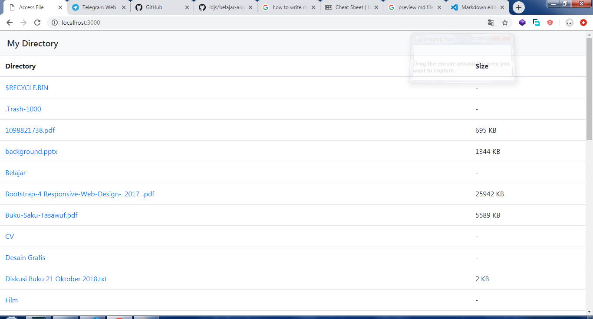

# Tugas 1 Directory Explorer

## Introduction
This is file access program where you can access your directory through web browser. This program will list file inside your directory and show the size of file.

## Preview



## How to use

1. Download and Install node.js <a href="https://nodejs.org/en/download">here</a>

2. Run the server
```
node server.js
```
3. Click the directory that you want

*and bummm*

----

***created by arifintahu***